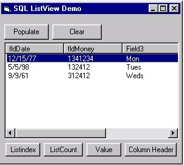



## ActiveX Data aware Listview control

### Description

This is a fully functional ActiveX control, which is a data aware wrapper for Listview control. Pass the listview a recordset and it will automatically populate. It also includes some different properties and methods. Also demonstrates ActiveX control creation.
 
### More Info
 
Open up the test.vbg project. This includes the control and a test form. It also includes an Access .mdb file for testing purposes. Data access code and Access file are a little dated.

             |
---                |---
**Submitted On**   |2000-07-28 23:15:04
**By**             |[Brian Lockwood](https://github.com/Planet-Source-Code/PSCIndex/blob/master/ByAuthor/brian-lockwood.md)
**Level**          |Advanced
**User Rating**    |4.0 (40 globes from 10 users)
**Compatibility**  |VB 5\.0, VB 6\.0
**Category**       |[OLE/ COM/ DCOM/ Active\-X](https://github.com/Planet-Source-Code/PSCIndex/blob/master/ByCategory/ole-com-dcom-active-x__1-29.md)
**World**          |[Visual Basic](https://github.com/Planet-Source-Code/PSCIndex/blob/master/ByWorld/visual-basic.md)
**Archive File**   |[CODE\_UPLOAD83117282000\.zip](https://github.com/Planet-Source-Code/brian-lockwood-activex-data-aware-listview-control__1-10176/archive/master.zip)

